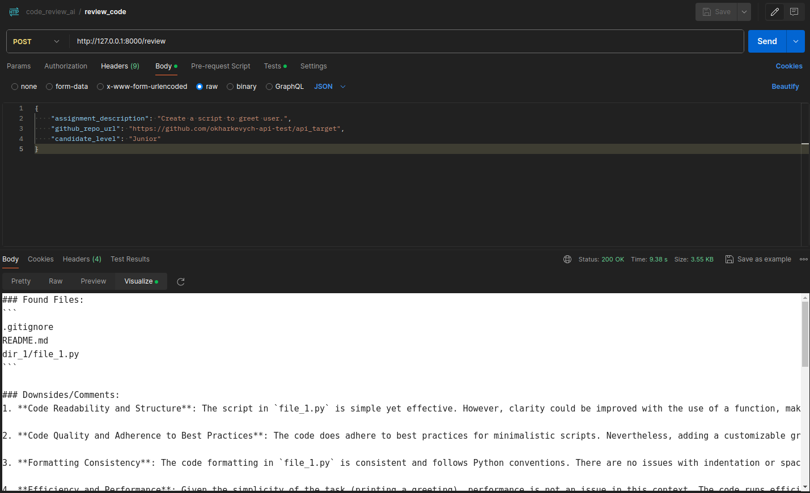

# CodeReviewAI


## Table of Contents
- [Introduction](README.md#introduction)
- [Sample screenshots](README.md#sample-screenshots)
- [System-wide dependencies list](README.md#system-wide-dependencies-list)
- [Project-wide dependencies list](README.md#project-wide-dependencies-list)
- [Installation](README.md#installation)
    * [System-wide dependencies](README.md#system-wide-dependencies)
    * [Repository import](README.md#repository-import)
    * [Project-wide dependencies](README.md#project-wide-dependencies)
- [How to run](README.md#how-to-run)


## Introduction
This is a backend prototype for a Coding Assignment Auto-Review Tool. This tool 
will help automate the process of reviewing coding assignment by leveraging 
OpenAI's GPT API for code analysis and the GitHub API for repository access.

POST '/review' endpoint accepts the following information in the request 
body:
- Description of the coding assignment.
- URL of the GitHub repository to review.
- Candidate's level (Junior, Middle, or Senior).

Upon receiving the request, the endpoint does the following:
- Use the GitHub API to fetch the repository contents.
- Use OpenAI's GPT API to analyze the code and generate a review.
- Return the review result in the following format: Found files, 
Downsides/Comments, Rating, Conclusion.


## Sample screenshots
<div align=center margin=auto> 
  
<p>Live response to Postman request sent to local server</p>
</div>


## System-wide dependencies list
You will need the following components installed:
- Python 3.x >> as the project is Python-based
- Git >> to get the project repository from GitHub
- Poetry >> to manage project-wide dependencies and run scripts in an isolated 
environment


## Project-wide dependencies list
**Regular dependencies**
- FastAPI: the main framework for building the REST API
- Pydantic: for data validation and settings management using Python type annotations
- python-dotenv: for loading environment variables from a .env file, making it easier to manage sensitive information like API keys
- HTTPX: for making asynchronous HTTP requests, which are needed for interacting with the GitHub and OpenAI APIs
- Uvicorn: an ASGI server for running FastAPI applications, allowing for asynchronous capabilities and serving the application efficiently

**Dev dependencies**
- pytest: for writing and running tests to ensure code quality and functionality
- pytest-asyncio: for testing asynchronous code with pytest
- pytest-cov: for measuring test coverage in the project
- pytest-mock: to simplify the mocking of objects and functions

## Installation
PLEASE NOTE: the instructions were written with Ubuntu OS in mind; the exact 
actions/commands may differ on other systems.

### System-wide dependencies
Please refer to the corresponding official instructions for:
- Python: https://www.python.org/downloads/
- Git: https://git-scm.com/book/en/v2/Getting-Started-Installing-Git
- Poetry: https://python-poetry.org/docs/#installation

### Repository import
- Open the directory you'd like to download this repository to in terminal.
- Enter the following command:

```
git clone https://github.com/okharkevych/code_review_ai.git
```

### Project-wide dependencies
- Open your 'code_review_ai' directory in terminal.
- To create a virtual environment isolated from your OS and install 
the project-wide dependecies in it, enter the following command:

```
poetry install
```


## How to run
- Open your 'code_review_ai' directory in terminal.

**Add environment variables**
- The project uses environment variables to securely store sensitive details 
(e.g. API keys).
- The variables in question are stored locally in a .env file.
- To proceed, you need to create this file and save the required values 
specific to you in it.
- To create a .env file enter the following command:

```
cp .env.example .env
```

- The '.env' file has appeared in your 'code_review_ai' directory.
- Open this file with a text editor of your choice.
- Inside, you'll see the environment variable(s) utilized by the project.
- Add the corresponding details specific to you after the '=' sign for each 
variable (e.g. API_KEY=adsfk-jh42398) and save the file.


**Optional: Customize GPT model**
- By default, CodeReviewAI uses 'GPT-4 Turbo' model.
- If you want to use another model, the 'GPT_MODEL' variable with your custom
value should be added in your '.env' file on a separate line.
- Example:
```
GPT_MODEL=gpt-5-turbo
```

**Run local server**
- Enter the following command:

```
poetry run uvicorn app.main:app --reload
```

- The terminal output will contain a line like 
"Uvicorn running on http://127.0.0.1:8000"
- Access the app web UI at the link indicated in your terminal.
- Add 'docs' at the end of the app link to access FastAPI documentation if 
needed.
- In our example, the documentation link will look like this: 
http://127.0.0.1:8000/docs
- The endpoint live performance can be checked with Postman requests or using 
an alternative of your choice.
